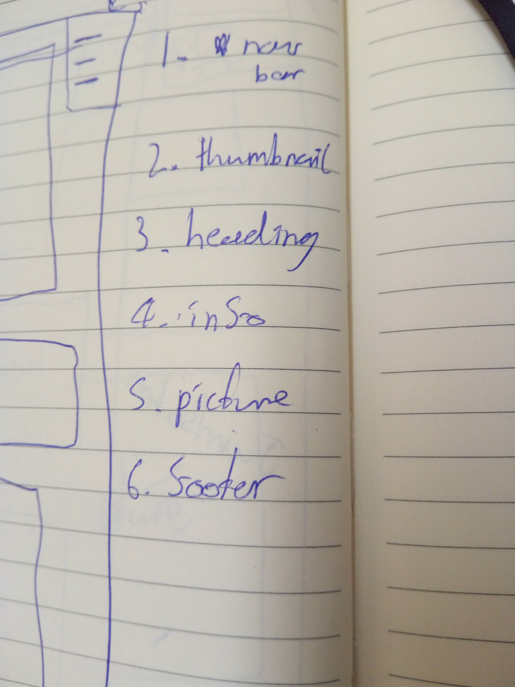
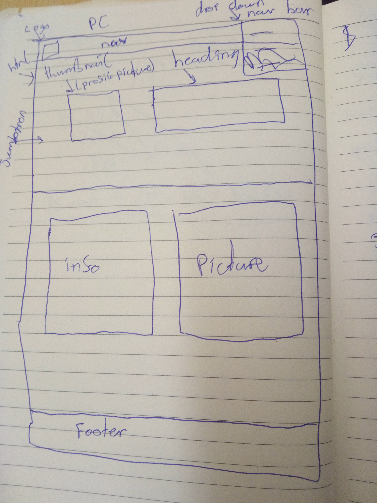
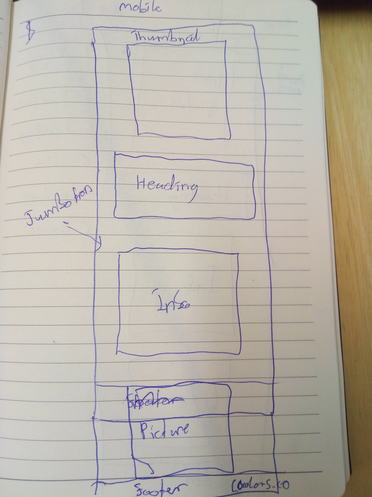
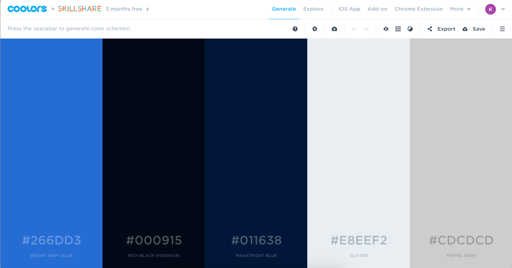

# Introduction - Personal Website Exercise

# Table of Contents

* [Checklist](#check-list)
* [Method](#method)
* [Wireframes](#wireframes)
* [Color-Scheme](#colorscheme)
* [Review](#review)

# Checklist

We were given a checklist and had to complete the steps in order.

- Make a Wireframe for both small and large devices
- Get approval from trainers for the Wireframes
- Make a Github repository for the website and make 10 commits
- Choose a color scheme on Coolers.co
- Install bootstrap
- Link custom stylesheet
- Build HTML template
- Start Bootstrapping/CSSing
- Make the web page responsive

# Method

The __*method*__ I used to build the website was to follow the __*checklist*__, write down my **immediate** objective then only move onto the next objective once I have __*completed*__ the one at hand.

I have an image showing the simple yet effective method **below:** 

# Wireframes

I wanted a mimimalist design with a Z design pattern so the user starts at the top left of the page, goes to the top right, back to the bottom left and then to the bottom right.

In retrospect I think the nav bar at the top is not the look I want and would instead have icons for the different pages and display them inline but without a bar behind them.

# Color-Scheme

For the color scheme I used the coolers.co color palette as shown below:

# Review

I found the exercise very useful as it helped me to adopt a better structure and workflow. The presentation was particularly useful as I need as much experience as possible presenting work I have done. 